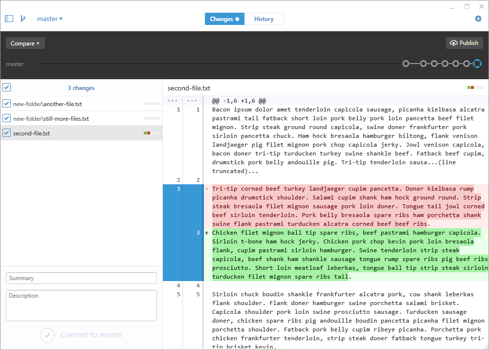
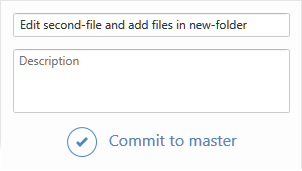
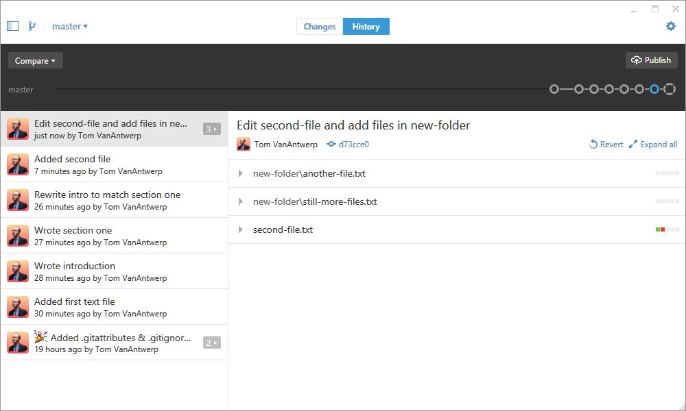

### Creating a History of Commits

Now that you've got a repository, you'll need to make commits to keep track of your work. In the GitHub desktop app, you'll have two main view for your repo: the commit history and the uncommitted changes. You can switch between these views with the buttons in the top-center of the program. You've already seen what the history view looks like when we viewed your first automatic commit. Let's make some changes to your repo and take a look at that!

In this example above, you can see a list of all of the files that have changed since the last commit. You can see that I'm adding two new text files in a folder called `new-folder`. I've also edited a file called `second-file.txt`, completely replacing the second paragraph of text as previewed on the right. Commits let us track saved changes to *any* file within the repo's folder. If no changes were made to a set of files, those files won't been seen in commit summaries.

The changes view allows me to review what I've done since the last commit and, if I'm happy with these changes, create a new commit with my changes. To do this, look at the box in the bottom-left corner and simply give the commit a name in the **Summary** field and click **Commit to master**.

Easy, right? Now we can go back to our history view and see the new commit at the top of our history with a full summary of the changes we made.

Now that you know how to review changes between commits and create new commits, you're ready to build a habit of committing changes to your work on a regular basis.

### When Should I Commit?

If you ask Google that question, you'll get all sorts of dubious relationship advice. I can't really advise you about relationships, but I can give you advice on when to create commits to your work.

You should try to make commits that are logical chunks of work that you've done. In my example commit history, I created commits for new files, new sections of text documents that I'd written, and for rewrites of those sections. You probably don't need to make a commit for adding a comma somewhere--you can wait and include that change with a larger body of changes. However, you shouldn't wait too long. If your repo only has a single commit of your finished work, then you're not really using version control at all.

As another example of what I mean by committing the logical chunks of your work as you go, here's the commit history of this guide up to this point:

